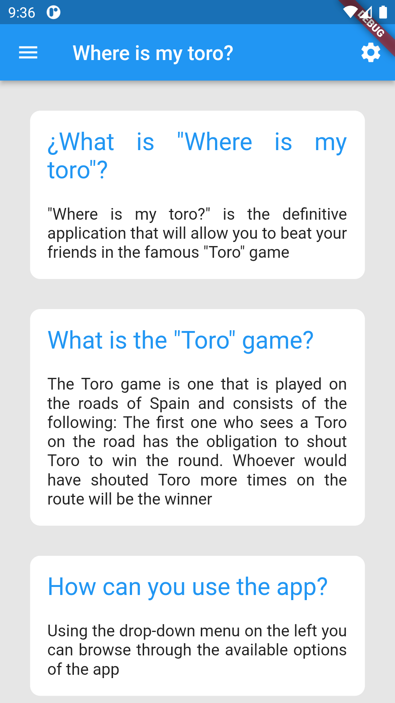
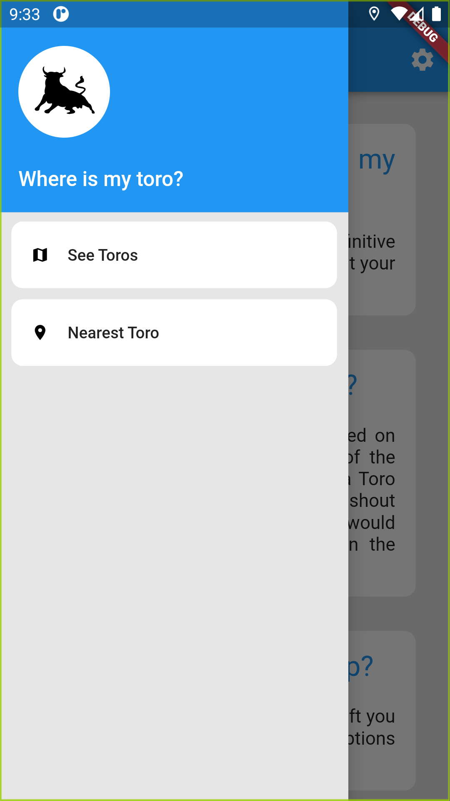
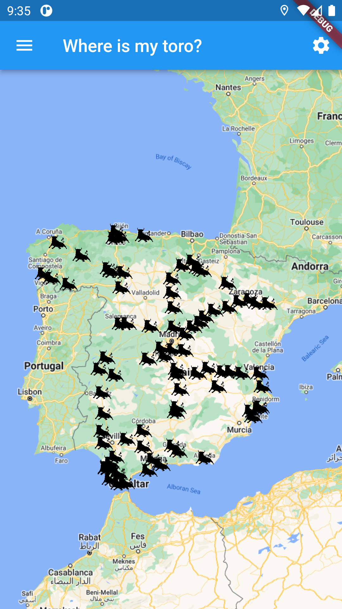
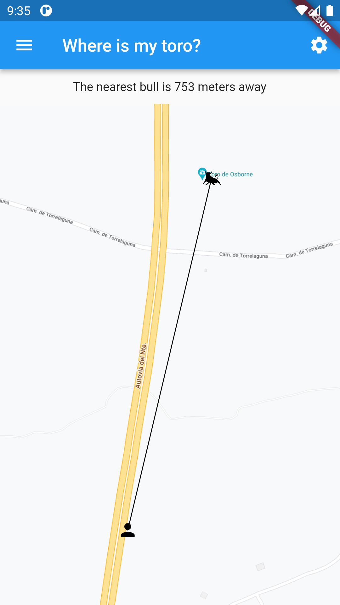
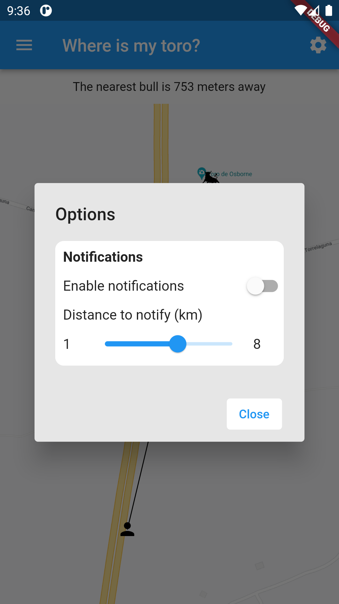

<!-- PROJECT LOGO -->
<br />
<div align="center">
  <a href="https://github.com/juanDeVicente/app_toro">
    
  </a>
  <h2>Where is my toro?</h2>
</div>

# About the project
"Where is my toro?" is the definitive application that will allow you to beat your friends in the famous "Toro" game

The Toro game is one that is played on the roads of Spain and consists of the following: The first one who sees a Toro on the road has the obligation to shout Toro to win the round. Whoever would have shouted Toro more times on the route will be the winner

## Built with

* 
* 
* 

# Getting Started

## Prerequisites

* Flutter. To install Flutter, please refer to the official [tutorial](https://docs.flutter.dev/get-started/install?gclid=Cj0KCQjwpeaYBhDXARIsAEzItbEZHl6VyGrWfp8HtM9sAiuAJc7FldQx_k-EWOtGNDUQSGcI2_LP4_4aAmIhEALw_wcB&gclsrc=aw.ds)

## Installation

1. Clone the repo
```sh
git clone https://github.com/juanDeVicente/app_toro.git
```
2. Install pubspec
```sh
flutter pub get
```

# Usage

When starting, the home page will be displayed


## See all the toros

Open the menu on the left and click on "See Toros"

Now it displays all Toros


## Calculate the distance to the nearest Toro

Open the menu on the left and click on "Nearest Toros"

Now it displays the distance to the nearest Toro


## Configure notification system

Open the configuration dialog


# Roadmap
- [x] See Toros
- [x] Calculate the distance to the nearest Toro
- [x] Notification when the distance to nearest Toro is less than a number
- [ ] Update the nearest Toro page in real time
- [ ] Play Toro game
- [ ] Make the toros in map interactuable

See the [open issues](https://github.com/juanDeVicente/app_toro/issues) for a full list of proposed features (and known issues).

## Contributing

Contributions are what make the open source community such an amazing place to learn, inspire, and create. Any contributions you make are **greatly appreciated**.

If you have a suggestion that would make this better, please fork the repo and create a pull request. You can also simply open an issue with the tag "enhancement".
Don't forget to give the project a star! Thanks again!

1. Fork the Project
2. Create your Feature Branch (`git checkout -b feature/AmazingFeature`)
3. Commit your Changes (`git commit -m 'Add some AmazingFeature'`)
4. Push to the Branch (`git push origin feature/AmazingFeature`)
5. Open a Pull Request

# License

Distributed under the MIT License. See `LICENSE.txt` for more information.

# Contact

Juan de Vicente Tortosa - [@juantortosa205](https://twitter.com/juantortosa205) - juandvtortosa@gmail.com

Project Link: [https://github.com/juanDeVicente/app_toro](https://github.com/juanDeVicente/app_toro)